# Fundamentals of Databricks SQL

## SECTION 1: INTRODUCTION TO DATABRICKS SQL

### What is Databricks SQL? 

Databricks SQL is a Databricks environment designed with SQL analysts in mind. You can use the built-in SQL query editor to write highly-performant queries directly on your organization's data lake, so you can be sure you are always working with the most complete and current information available. The drag-and-drop visualization editor and dashboarding tool allow you to easily visualize and collect query results, and your shared workspace can simplify the discovery and sharing of new insights. You can also connect to your preferred business intelligence (BI) tools, and use Databricks SQL to power your queries for fast performance. 

The Databricks SQL UI lets you:

- Use SQL commands to perform ad-hoc and exploratory data analysis on your data lake
- Quickly develop agile dashboards to test and validate business requirements
- Track KPIs with automatic alerts or dashboard refresh on the latest data

BI tools provide:

- A no code, drag and drop interface for data analytics
- Enterprise-wide distributed reports and dashboards
- Complex interconnected dashboards for advanced parameter filtering and customization

### Performance

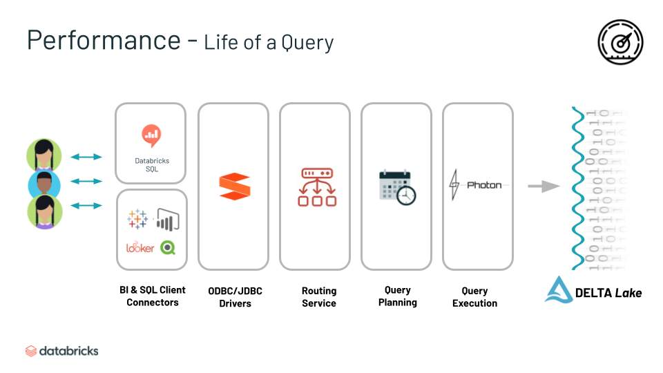

**a. Write Queries**
You can write queries via the Databricks SQL UI or using your favorite BI tool. For enterprise dashboarding, you may want to connect to your favorite Business Intelligence (BI) tool. Databricks connects to a wide variety of BI tools and even offers native connectors for some popular tools, like Tableau and Power BI. 

**b. ODBC/JDBC Drivers**
When you run your query from the Databricks SQL  UI or your favorite BI tool, they pass through a JDBC or ODBC driver. These drivers allow applications to access data using SQL.  

Our new drivers have been re-engineered to provide lower latencies and higher data transfer speeds.

**c. Routing Service**
SQL Endpoints are a shared resource that power your queries. The routing service offers scalable query routing and load balancing with predictable low latency characteristics. 

**d. Query Planning**
Queries are planned and optimized to be as efficient as possible and accelerate workloads on data lakes up to 18x.  

**e. Query Execution**
**Photon** is a new, vectorized query engine designed to take advantage of modern CPU architecture for extremely fast parallel processing of data. 

**f. Delta Lake**
Delta Lake brings reliability and organization to data lakes. When you use Databricks SQL, you are querying directly on your Delta Lake. While you're getting super fast performance, you're also accessing the same up-to-date and reliable data as the rest of your team. 

### Foundation Concepts

Working with Databricks SQL means you will be working with Spark.  For the most part, this will not change anything about the way you write queries to access data. You will continue to use SQL to query and analyze data.  However, in order to start writing queries, you will need a Databricks Administrator to set up two things: 

**1. A SQL Endpoint:**

A Databricks SQL Endpoint is the computational resource that powers your queries.Your SQL Endpoint will be set up and configured for your use by your Databricks Workspace Admin. You can access the endpoint(s) that you will use from the Endpoints menu. 

Endpoints can be configured to allow access to specific data objects, like tables, databases, or views, so the endpoint you select may depend on the type of work you are about to do. 

To select and start an endpoint, simply click Start on the endpoint you choose.  To run any query, you must have a running SQL endpoint. 

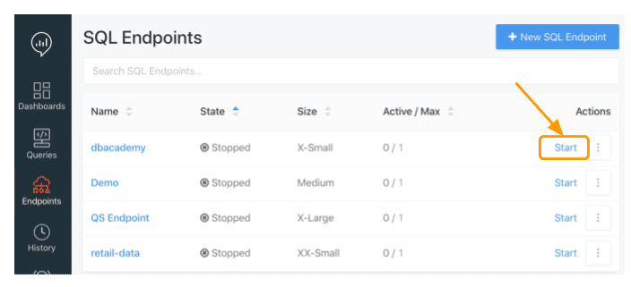

**2. Access to a Databricks Database**

In general, you will be querying cleaned and prepared data that has been organized into tables for you. A Databricks Database is a collection of tables.  When you enter the Query Editor and select your running SQL endpoint, you will also see a list of databases you can access. When you choose one, you will see a list of the associated tables in the schema browser that appears directly below. 

In your queries, you will use the database name and table name to identify the data you want.

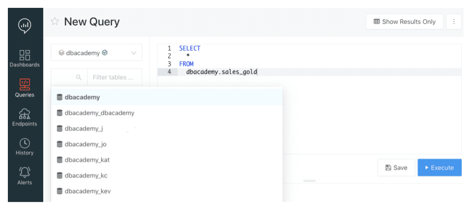

### DataBricks SQL UI Interface

- Landing page: From any screen, you can expand this menu and click this button to be brought back to the landing page. 
- Create: Use this button to create a new query, dashboard, or alert.
    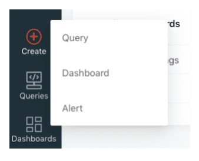

- Dashboards: Click this button to view all of the available dashboards in your organization. 
    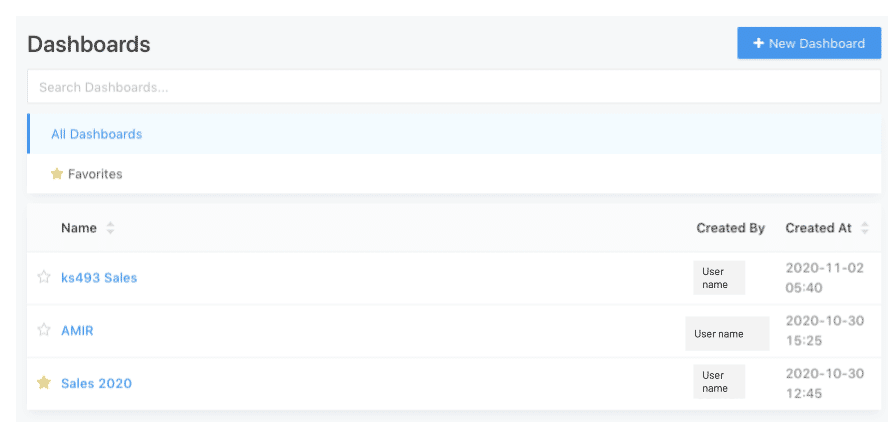
    From here, you can:
    - Select or deselect favorites
    - Create a new dashboard
    - Open and edit existing dashboards
- Queries: Click this button to view all available queries in your organization.
    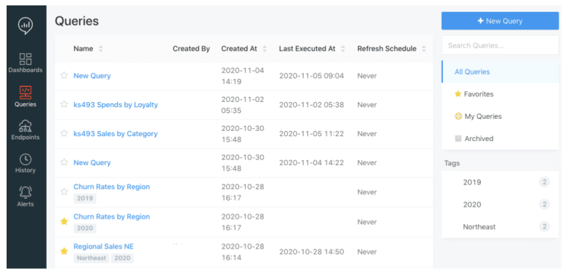
    From here, you can:
    - Select or deselect favorites. These show up on the main landing page. 
    - Create a new query
    - Open and edit existing queries
- Alerts: Alerts are a built-in feature to help you monitor your data and be aware of when it reaches certain thresholds. You can use this tab to set new alerts and check the status of existing alerts.
- Data: Click this button to access the Data Explorer, where you can view information about databases and tables in your workspace that you have permission to work with.
- Endpoints: This will bring you to the Endpoints menu, which shows all of the SQL endpoints you have access to. 
From here, you can start and stop SQL Endpoints, as well as access the query history associated with any endpoint. 
    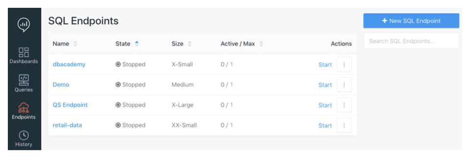
- Query History: The Query History tab contains information about previously run queries. You can filter by user, date range, endpoint, and status. Clicking on a query will show the query details. 
- Help: This button opens up documentation for working with Databricks SQL Analytics
    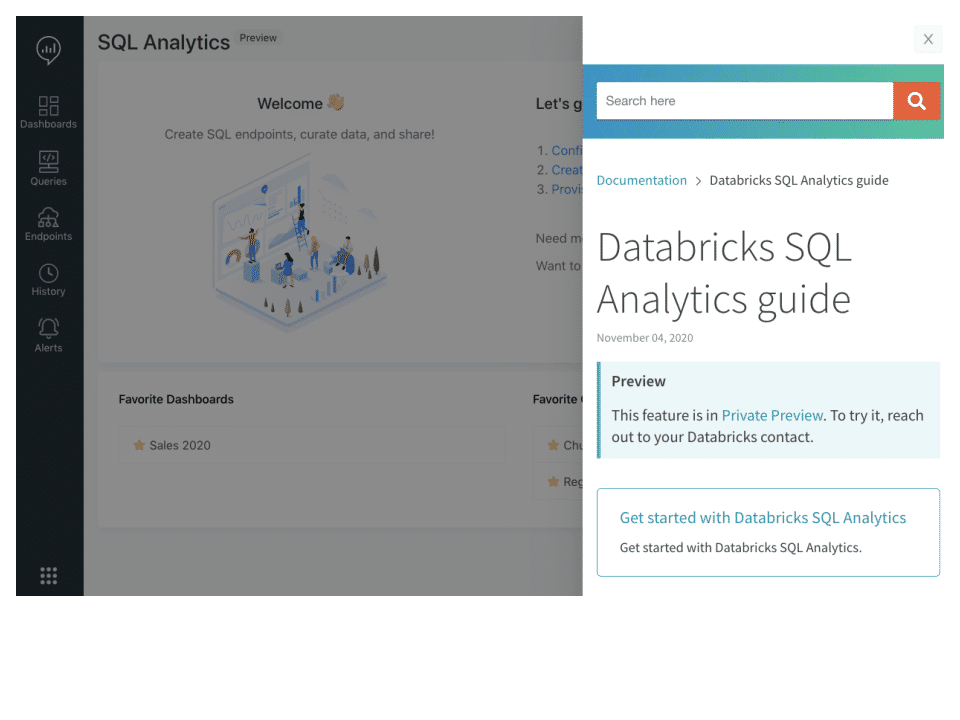
- Settings: You can use this button to access user settings. In Settings, you can create and revoke personal access tokens, manage general settings, and view account details. If you have access to more than one Databricks workspace, you can use this button to quickly navigate to those. 
- Menu Options: Menu options allow you to set default behavior for this menu pop-out. 

## SECTION 2: QUERYING DATA

### Querying Basics

When you click on the Queries tab, you will see a list of your organization's shared queries. You can search queries by name, as well as filter by favorites or by tag.

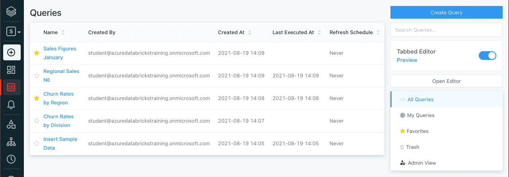

- Step 1:  Enable Tabbed Editor - Toggle this switch on to enable the ability to edit multiple queries at one time.
    
- Step 2: Create - From the query menu, click on Create Query
  
- Step 3: Check Endpoint - That will open the Query Editor. Remember, in order for you to run queries, you must have a running SQL Endpoint. Use the dropdown menu to select the one you want to use.
    
    A green check mark indicates a running endpoint. 
- Step 4: Select Database - A database name (or list of databases) can be accessed in the database drop-down menu. 

    Once you select a database, you can see the table names that you will use in your queries.
    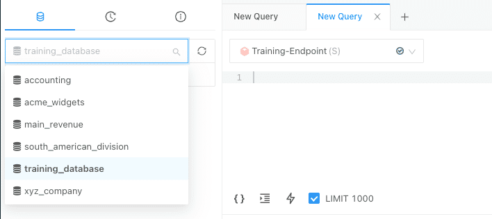
- Step 5: Preview Tables - If you have access to a table's metadata, you can learn about the column names and types of data in a table. 
    When you click on the table name, the schema browser shows details about a table's schema. 
    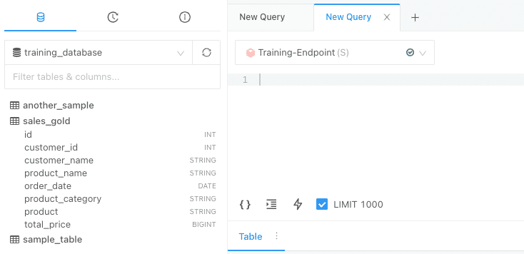
- Step 6: Write a Query - You can write queries by typing in the query editor. 
  - The query editor offers autocomplete and auto-formatting options.  
  - To auto-format: use the auto-format button or CMD + Shift + F
  - To turn autocomplete off/on: Click on the lightning bolt under the input box. 
  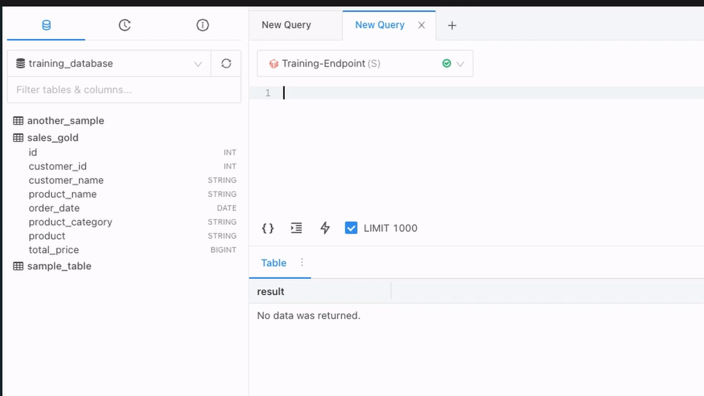
- Step 7: Execute and Save - To execute your query, click the Run button (1), or hit Shift + Enter
    If you want to save this query, rename it (2) and click Save (3). 
    
- Step 8: Open Another Tab - You can use Open Query (1) to open an existing query on a new tab or you can use the + to open a new empty tab (2).¨
    
- Step 9: Clone - Sometimes, you may want to copy a query. In Databricks SQL, you can Clone a query to create a new copy. 
    

### View, Edit,  Archive, and Share Queries

1. View: When you select a query from the Queries page, you will see the results of the query (as a table) and all visualizations associated with that query.  You can use the Refresh button to update results with current data.

    

2. Edit: To edit the query itself, click the the title of the query to open the Query editor.
   
3. Archive: If you want to remove the query from the main list, you can move it to the trash. 
    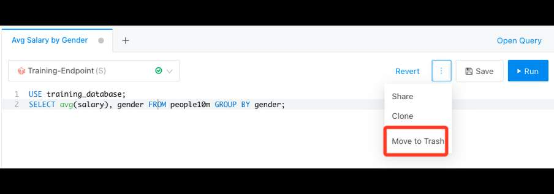
4. Share: Query permissions can be managed at the individual query level. Once you have written and saved a query, you have "Can Manage" permissions to that query. After you click the Share button in the Query Editor, you can choose to share the query with all users, a certain group, or an individual in your organization. 
   

### Automate Workflows

One of the big advantages to querying your organization's Lakehouse is that your data is routinely updated so you're working with the most current values. In some cases, you may want to continually watch the data to be sure some values don't fall outside a certain range. Consider the following examples: 

1) You work in a retail organization tracking product sales and inventory. You regularly write queries to better understand the makeup of upcoming orders, existing supply, and expected deliveries. You regularly monitor changes throughout the day to ensure you can respond to developing trends. 

2) You work for a navigation app that delivers real-time recommendations for products and services along a traveler's route. You have dashboards set up to balance an advertiser's spend with the number of ads your company is delivering. You check the data periodically to be sure you are not exceeding anticipated values.

In each of these scenarios, the stakes are high, and continuous monitoring is manual. All it takes is a missed check-in to cause an expensive problem. With Databricks SQL Analytics, you can set a schedule to automatically refresh your queries and set alerts to let you know when some value falls outside of your expected range. 

**Scheduling and Alerts**

- Step 1: Set a Refresh Schedule - In your query editor, you will find that the Refresh schedule is set to Never by default. Click on Never to bring up the Refresh Schedule dialog, and select a refresh frequency and optional end date. Then, click ok. 
  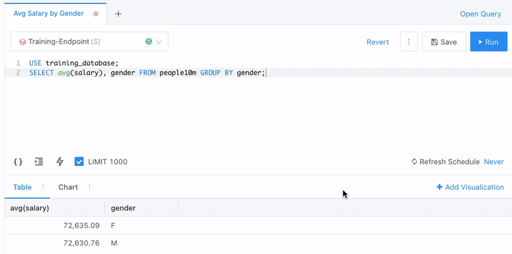
- Step 2: Set an Alert - Click on the Alerts tab to set an Alert for your query. Use the search functionality to find your query by name. Set the threshold trigger. You can choose notification preferences like how frequently you want to be notified when the threshold trigger has been reached, as well as how you want to be notified, e.g., email, Slack, PagerDuty.
  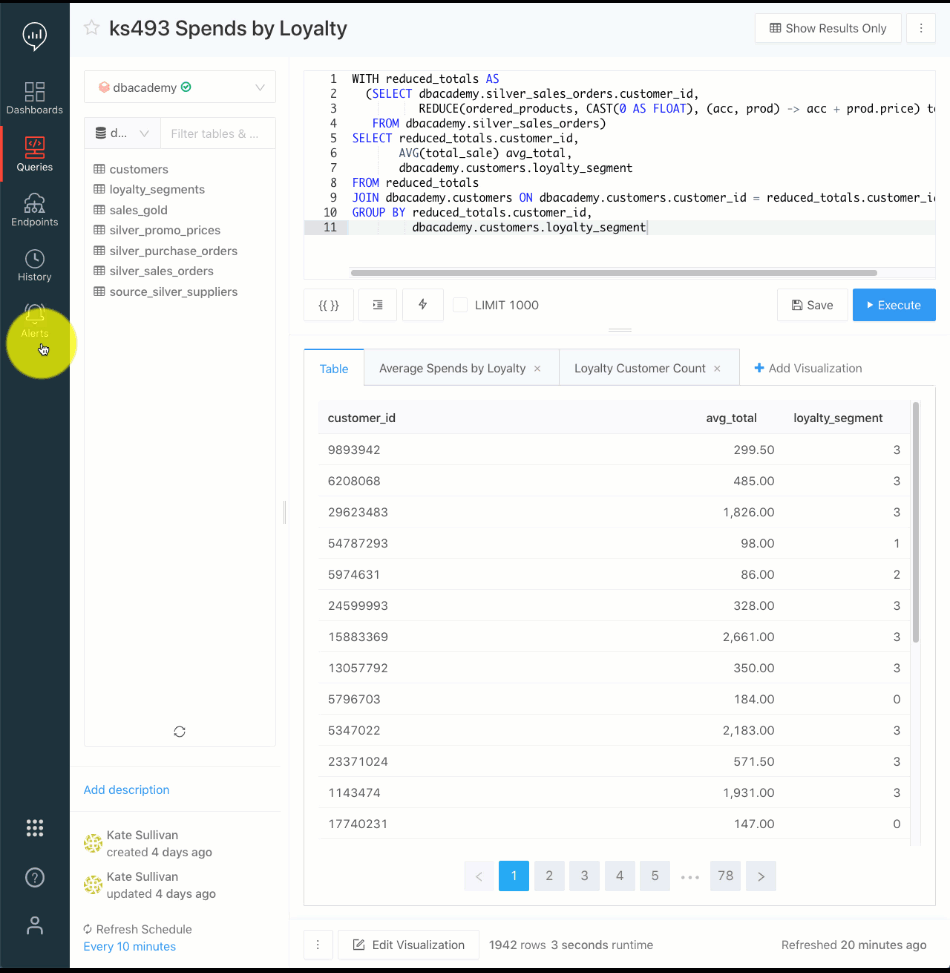

## SECTION 3: VISUALIZATIONS AND DASHBOARDS

### Visualize Query Results

- Step 1: The Visualization Editor - The visualization editor is a drag-and-drop interface for creating many types of visualizations.
  
- Step 2: Visualization Types - You can choose from many different types of visualizations. In this example, we'll use a chart.
  
- Step 3: Visualization Name - Any visualization is tied to a specific query. When you add visualizations to a dashboard, for example, you will first find the query, and then, select the name of the visualization you want to use. You can choose a descriptive visualization name in the editor.
  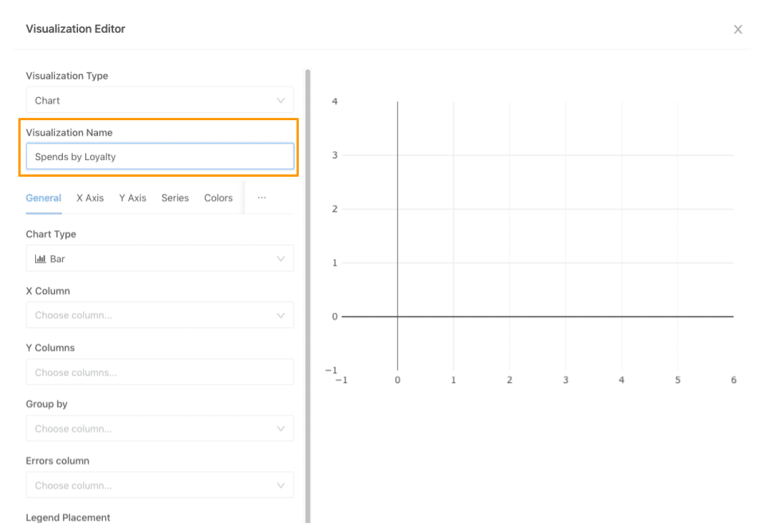
- Step 4: Chart Type - There are many different types of charts available to describe your data.
  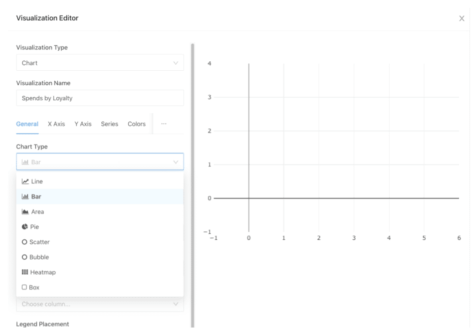
- Step 5: X Column - Column selections are pre-populated with the column names in your query result. 
  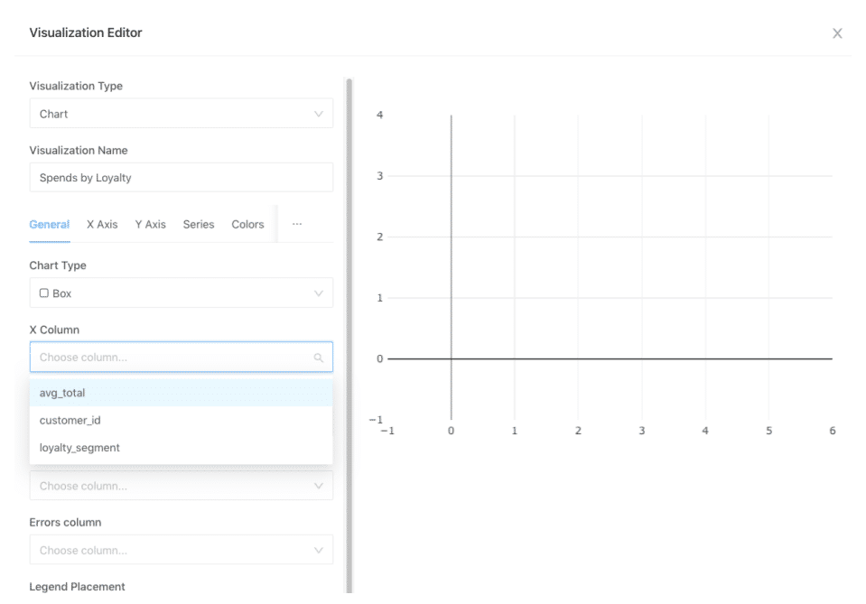
- Step 6: Y Column - As soon as you select x and y values, you'll see a preview of your chart. 
  
- Step 7: Additional Selections - To the right of the General settings, you'll see other customization options. 
  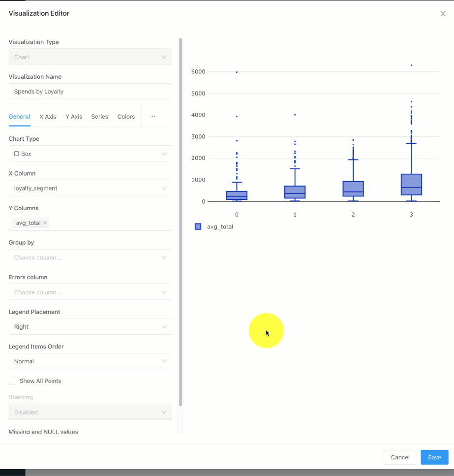

### Build and Edit Dashboards

- Step 1: The Dashboard Editor - When you click on New Dashboard, you will open the Dashboard editor. You can add text and visualizations to dashboards. 
  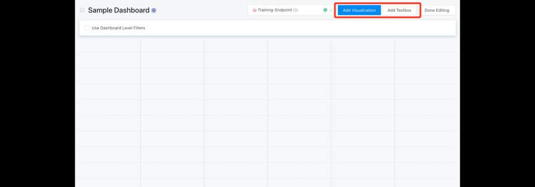
- Step 2: Text boxes - You can use basic Markdown to add notes to your dashboards. 
  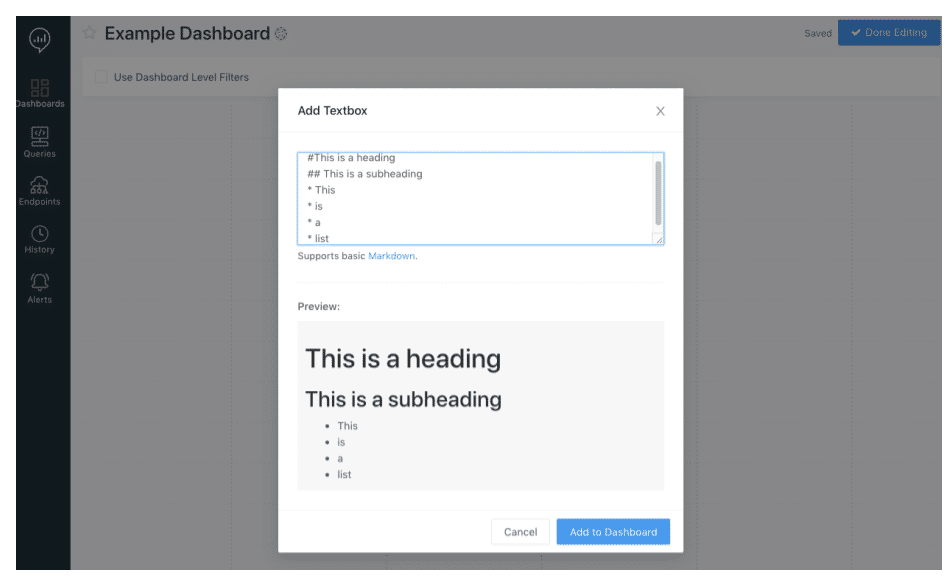
- Step 3: Select Query - Adding a visualization will prompt you to select a query.
  
- Step 4: Select Visualization - Once you select a query, you will see all associated visualizations
  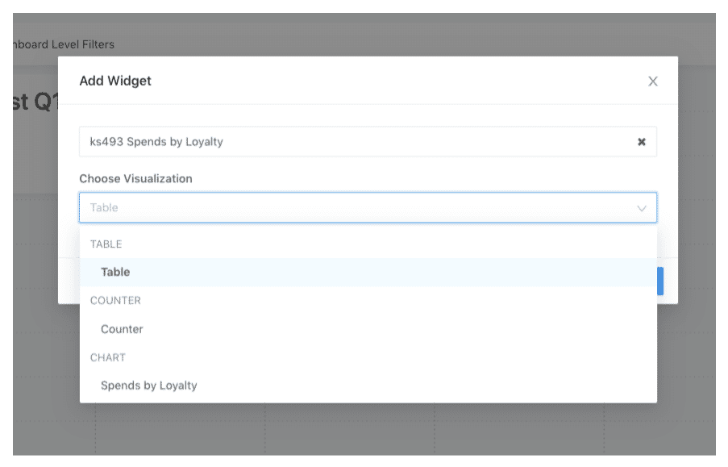
- Step 5: Resize and Arrange - You can rearrange and resize widgets and text boxes. To exit the editor, click Save.
  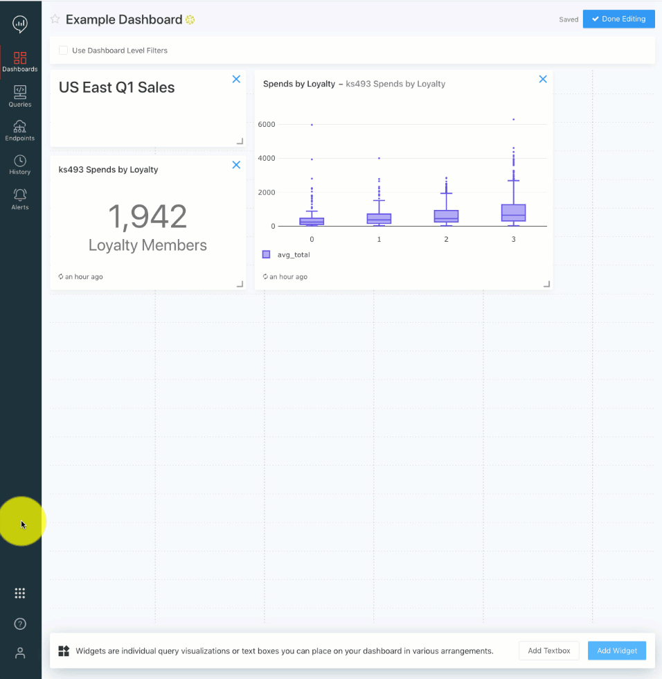

### Connect to Business Intelligence Tools

**Core Concepts and Terminology**

- **JDBC/ODBC Driver** - For some BI tools, you will use the Databricks JDBC or ODBC driver to make a connection to Databricks compute resources. These enable our applications to use SQL to access data. 

- **Personal Access Token** -  A personal access token is an automatically generated string you can use as an alternate password to authorize your BI tool to access Databricks resources. 

**General Instructions**

- Step 1: Use the chart to determine if you need to download a Databricks JDBC or ODBC driver.
  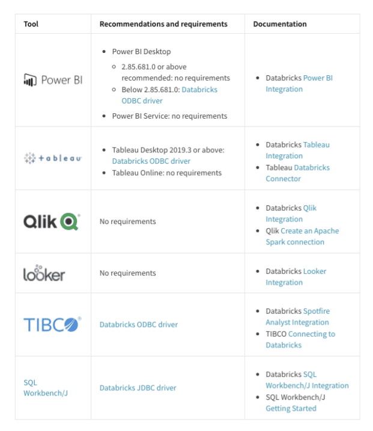
- Step 2: Locate Connection Details for the Endpoint you want to connect with. 

    You can find these by clicking on the Endpoint name from the Endpoints menu.
  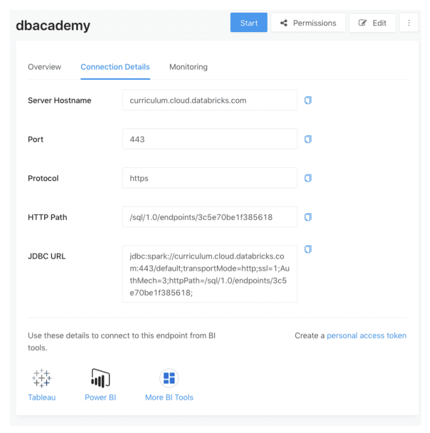
- Step 3: Navigate to settings to create a personal access token. 
  